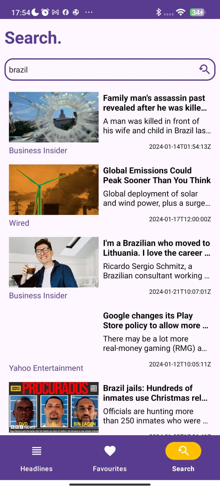

# NewsApp
App que consome a API https://newsapi.org/

# Funcionalidades 
- Lista noticias
- abre uma WebView
- salva as noticias favoritas
- Busca na api
- deleta do banco as favoritas atravez do gesto swipe
# Tecnologias utilizadas
- Kotlin
- MVVM
- LiveData
- Pagination
- ROOM
- Navigation
- Retrofit
## Layout mobile

  
  
  

